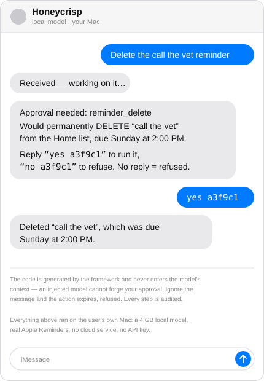

# Cortland 🍎

**Give an AI real access to your Mac — Mail, Calendar, Reminders, Notes, files —
without giving it the keys.** Every consequential action previews first, waits
for your approval through a channel the model can't touch, gets logged, and can
be undone. Bring your own model: Claude, or a local one that never leaves the
machine.

```
You:       Add a reminder to call the vet tomorrow at 2pm
Cortland: Received — working on it…
Cortland: Added "Call vet" for tomorrow, Aug 3 at 2:00 PM.
```

That conversation happened over iMessage, answered by a 4 GB model running on
an 8 GB MacBook Air. Nothing left the Mac.

---

## What it looks like in use

**Ask about your week** — reads are free, no approval needed:

```
You:       Anything from the school this week?
Cortland: Three emails from Lincoln Elementary. Two are the weekly
            newsletter; one from Ms. Alvarez on Tuesday asks for a
            permission slip by Friday.
```

**Ask it to change something** — writes stop and ask, every time:

<p align="center">
  
</p>

The code in that prompt is generated by the framework and never enters the
model's context — so even a fully prompt-injected model can't forge your
approval. Ignore the message and the action expires, refused.

**Ask what it can do** — answered from the tools actually installed, so it
can't overclaim:

```
You:       what can you do?
Cortland: Here's what I can do with your Mac:
            • Calendar: list, look up, create, delete
            • Mail: search, read, follow threads, draft (never send), flag, file
            • Notes: search, read, create, add to
            • Reminders: list, search, create, tick off, delete

            Anything that deletes or changes things asks you first — I text
            you a code and wait for "yes <code>". Reads just happen.
```

**In Claude Code or Claude Desktop**, the same tools are just there:

> **You:** draft a reply to Ms. Alvarez saying the slip is coming Thursday
> **Claude:** *[searches mail, reads the thread, creates a draft]* Drafted a
> reply in your Personal account. It's in Mail's Drafts — I can't send it;
> sending is yours.

There is no send-email tool. Not gated — **absent**.

---

## Why it exists

Most MCP servers for personal data are thin wrappers around AppleScript:
`delete_email`, `send_message`, executed the instant a model calls them. That's
a hard thing to trust with an inbox, and the alternatives don't help — cloud
assistants (Poke, Arlo, Lindy) can't touch Apple-native data at all, because
Apple gives them no API, and self-hosted agents like OpenClaw run ungoverned
(a CVSS 8.8 in January 2026, with permission gates still on the roadmap).

Cortland inverts the default. A tool call *previews* what it would do unless
you've opted into live mode, and even then every consequential action waits for
you. The framework enforcing that is a small library with a test suite proving
each guarantee can't be bypassed — and every tool in the suite is built on it.

---

## The guarantees

| | |
|---|---|
| **Dry-run by default** | Gated tools preview instead of executing. Every config error resolves *toward* dry-run. |
| **The human gate is out-of-band** | Approval arrives via a native dialog, a file you move, your client's own UI, or a text you reply to — never through model text. |
| **Everything is audited** | Success, failure, dry-run, denial, refusal: one local SQLite row each. "What did my tools actually do?" always has an answer. |
| **Undo is enforced at registration** | A tool claiming native undo must produce a recipe *before* the write, or the framework refuses it. |
| **Content is data, not instructions** | Everything read from mail, notes, or messages returns inside a nonce-delimited fence. |
| **Safety by absence** | No send-email tool. No attendee invitations. No reading conversations other than your own. |
| **Local-first** | No accounts, no credentials, no cloud. Your model, your machine, your disk. |

---

## Install

```bash
npm install -g @cortland/setup @cortland/mail @cortland/reminders \
  @cortland/notes @cortland/calendar @cortland/context
cortland setup
```

The wizard asks before every step and records what it did. Full walkthrough —
including the iMessage bridge, permissions, and model choice — in
**[SETUP.md](SETUP.md)**.

---

## Packages

| Package | What it does |
|---|---|
| [`@cortland/governed`](https://www.npmjs.com/package/@cortland/governed) | The framework: dry-run defaults, approval gates, audit, provenance, undo, injection fencing. Build your own governed tools on it. |
| [`@cortland/mail`](https://www.npmjs.com/package/@cortland/mail) | Apple Mail: read, search (two tiers), threads, drafts. Draft-first — no send tool exists. |
| [`@cortland/reminders`](https://www.npmjs.com/package/@cortland/reminders) | Reminders: lists, search, create, complete, delete — with native undo. |
| [`@cortland/notes`](https://www.npmjs.com/package/@cortland/notes) | Notes: folders, search, read, create, append. |
| [`@cortland/calendar`](https://www.npmjs.com/package/@cortland/calendar) | Calendar: window queries, create, delete. Cannot send invitations, by design. |
| [`@cortland/context`](https://www.npmjs.com/package/@cortland/context) | Local context layer: mail/calendar *metadata* (pointers, never bodies), briefings, person lookups, a corrections flywheel. |
| [`@cortland/imessage`](https://www.npmjs.com/package/@cortland/imessage) | Text your own AI. Owner-only by construction, approvals by reply. |
| [`@cortland/folders`](https://www.npmjs.com/package/@cortland/folders) | Folder-as-API: drop a file in iCloud from any device, a declared local pipeline runs. |
| [`@cortland/remote`](https://www.npmjs.com/package/@cortland/remote) | Reach the suite from your other devices over your own private network. |
| [`@cortland/setup`](https://www.npmjs.com/package/@cortland/setup) | The onboarding wizard. |

---

## Bring your own model

The servers speak MCP, so any MCP client works — Claude Code, Claude Desktop,
LM Studio, or the iMessage bridge driving a local model through Ollama.

Field-tested on an 8 GB M2: `gemma4:e2b-it-qat` (4.3 GB) makes clean tool calls
and refuses honestly. The governed contract matters *more* with a small model,
not less — dry-run defaults and per-action gates are exactly the harness that
makes a fallible local model safe to hand your inbox.

---

## Privacy model

- **Pointers, not copies.** The context layer stores metadata referencing
  messages by ID; bodies are never stored. Delete a message in Mail and the
  pointer dangles and gets pruned.
- **Model use is opt-in and declared.** Works fully deterministically with no
  model. Configure one and its network egress is declared in config and
  recorded in the audit log on every run.
- **Nothing phones home.** The only optional outbound call is a push ping you
  configure yourself, and its body is a fixed string carrying no information.

---

## Docs

- **[SETUP.md](SETUP.md)** — clean Mac to working assistant, with the gotchas.
- **[SECURITY.md](SECURITY.md)** — reporting, and what's in scope.
- **`docs/`** — one design doc per component: the framework contract (01),
  Mail (02), folder-as-API (03), the context layer (04), remote access (05),
  the iMessage bridge (06), and the threat model / review guide (07).
- **`NOTES.md`** — the engineering log: decisions with dates, open questions,
  and every field finding, including the ones that were embarrassing.

## License

MIT. See [LICENSE](LICENSE).
